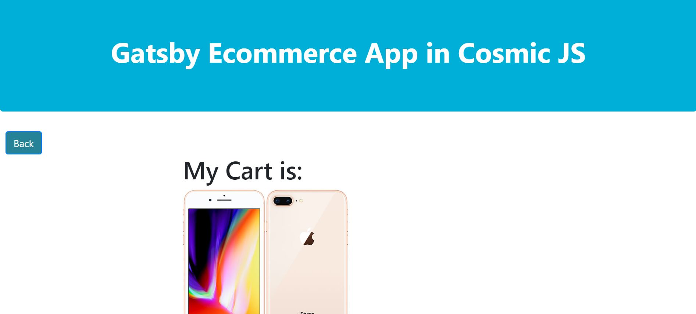

# POOC GATSBY E-commerce 

It is a poc of the static serverless site generator named Gastby, which works with ReactJs.
This application also uses a Headless CMS named CosmicJS. Here it serves as an API to manage the content of ecommerce

